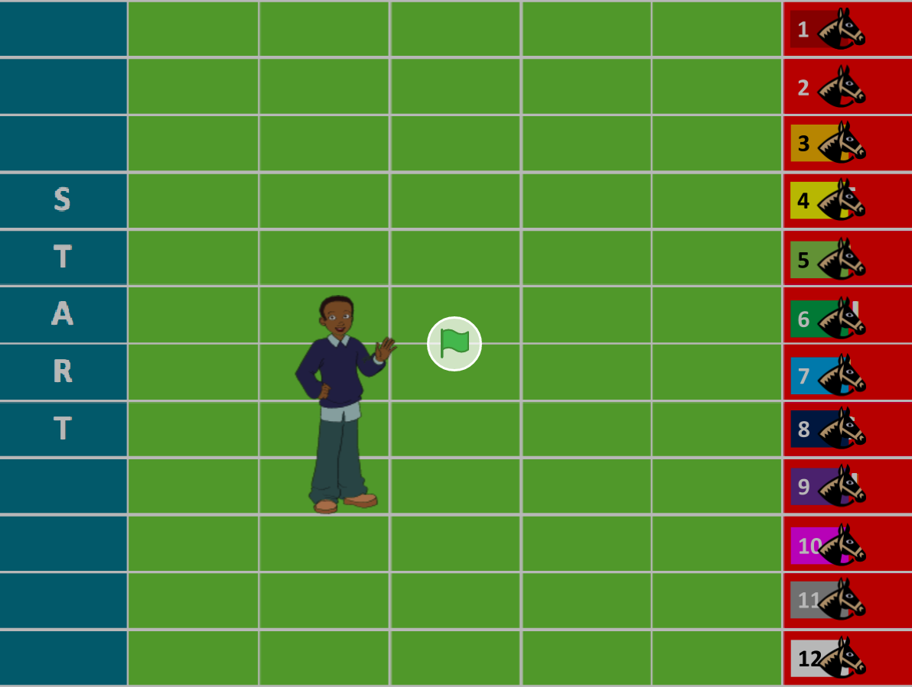

# Horse Race Game
## Made from Scratch Editor (MIT)

## About
Game Created to meet the requirements of Week 0 of the CS50x Course, taught by Harvard University. CS50x is a course Introduction to the intellectual enterprises of computer science and the art of programming. 

## How to play:
Open the Game: https://scratch.mit.edu/projects/414511183/ 

To play, just click on the flag. The character that appears will ask you a question.  You need answer by typing on the keyboard between horse number 1 to 12. 

## Screenshots:

## Source Code
To see the source code, just download the file <b>'HorseRace.sb3'</b> and importer into the scratch editor: https://scratch.mit.edu

## Contact:
To contact me send an email.   
Email: leonidasamorim@gmail.com